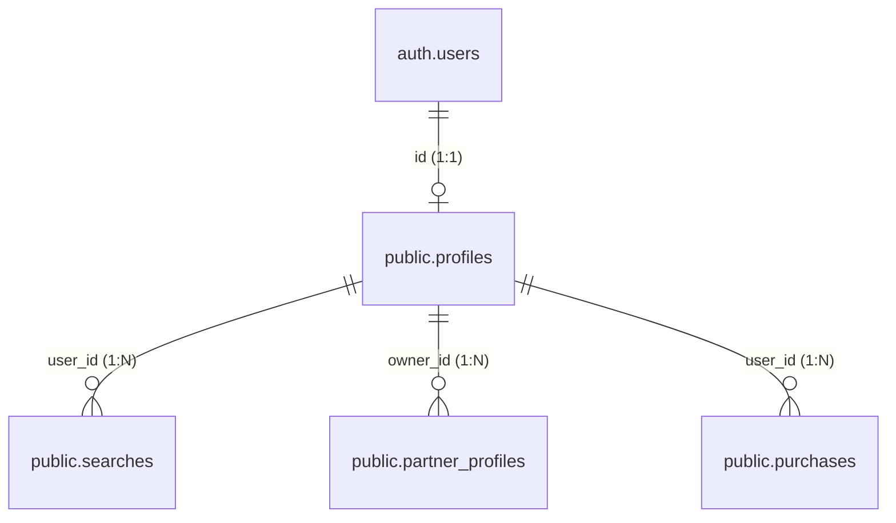

# Astronat Database & Architecture Overview

## 1. Authentication (Login & Logoff)

Authentication is handled entirely by **Supabase Auth** over HTTP-only cookies (`@supabase/ssr`).

### The Login Flow
1. User clicks "Continue with Google" → Supabase initiates the OAuth redirect.
2. Google authenticates them and redirects back to `/auth/callback?code=...`.
3. The callback route handler exchanges the code for a session (JWT stored in a cookie).
4. Supabase creates (or looks up) a row in its internal `auth.users` table.
5. The callback then checks if a `public.profiles` row exists:
   - **New user** → redirected to `/flow` (onboarding + subscription gate).
   - **Returning user, subscribed** → redirected to `/home`.
   - **Returning user, not subscribed** → redirected to `/flow?step=1` (paywall).

### The Logoff Flow
Calling `supabase.auth.signOut()` destroys the server session and clears the cookie. Middleware then redirects any protected-route access back to `/auth/login`.

---

## 2. Database Schema

All app data hangs off a central `public.profiles` table, keyed by the `auth.users` UUID.



### Key columns on `public.profiles`

| Column | Type | Purpose |
|---|---|---|
| `id` | UUID | PK — mirrors `auth.users.id` |
| `stripe_customer_id` | TEXT | Stripe Customer ID — set on first checkout |
| `is_subscribed` | BOOLEAN | **Fast subscription gate** — written by webhook |
| `subscription_status` | TEXT | `'active'` \| `'trialing'` \| `'past_due'` \| `'canceled'` |
| `subscription_id` | TEXT | Stripe Subscription ID — for Stripe API lookups |
| `subscription_ends_at` | TIMESTAMPTZ | `current_period_end` — shown in billing UI |

---

## 3. Subscription: Source of Truth

> **Single answer: The Stripe Webhook writes to `profiles`. That is the only source of truth.**

### Why not the Stripe FDW view?

The `20260331` migration installs the **Stripe Foreign Data Wrapper** (FDW), which lets Postgres query `stripe.subscriptions` as if it were a local table. A `user_subscription_status` view was originally drafted on top of it.

**That view has been removed.** Here's why:

| | FDW View | Webhook → `profiles` columns |
|---|---|---|
| Speed | ❌ Live Stripe HTTP call on every query | ✅ A local Postgres column read |
| Edge Middleware | ❌ Middleware can't hit the DB directly | ✅ Works (read via server component before redirect) |
| RLS | ❌ Unreliable on foreign tables | ✅ Full RLS support |
| Renewal/cancel sync | ✅ Always live | ✅ Handled via webhook events |
| Rate limits | ❌ Stripe API limits apply | ✅ None |

The **FDW tables remain** (`stripe.subscriptions`, `stripe.customers`, etc.) — they are available in the **Supabase SQL Editor for admin auditing**, e.g. to manually inspect a user's subscription state without leaving the dashboard.

### Webhook Events Handled

| Event | Action |
|---|---|
| `checkout.session.completed` | Insert `purchases` row; retrieve subscription and sync; send welcome email |
| `customer.subscription.created` | Sync `is_subscribed=true`, write `subscription_status`, `subscription_ends_at` |
| `customer.subscription.updated` | Re-sync all subscription fields (handles renewals, plan changes, past_due) |
| `customer.subscription.deleted` | Set `is_subscribed=false`, `subscription_status='canceled'` |

### Reading Subscription Status in Code

```ts
// In a Server Component or API route:
const { data: profile } = await supabase
  .from('profiles')
  .select('is_subscribed, subscription_status, subscription_ends_at')
  .eq('id', user.id)
  .single()

if (!profile?.is_subscribed) redirect('/flow?step=1')
```

---

## 4. The Stripe Payment Flow

```mermaid
sequenceDiagram
    participant User
    participant App as Next.js App
    participant Stripe
    participant Webhook as /api/stripe/webhook
    participant DB as Supabase (profiles)
    participant Email as /api/send-welcome-email

    User->>App: Clicks "Subscribe to Pro"
    App->>Stripe: POST /api/checkout → createCheckoutSession(userId)
    Stripe-->>User: Redirect to Stripe Checkout
    User->>Stripe: Enters card & pays
    Stripe-->>User: Redirect to /flow?step=2

    Note over Stripe,Email: Async background (arrives within seconds)
    Stripe->>Webhook: POST checkout.session.completed
    Webhook->>DB: INSERT purchases; UPDATE profiles SET is_subscribed=true
    Webhook->>Stripe: Retrieve full subscription object
    Webhook->>DB: UPDATE profiles SET subscription_status, subscription_ends_at
    Webhook->>Email: POST /api/send-welcome-email (internal)
    Email-->>User: Welcome email via Resend
```

---

## 5. Row Level Security

All tables enforce RLS: `USING (auth.uid() = user_id)` / `USING (auth.uid() = id)`. Even if a user queries the database directly from the browser they can only ever read their own rows. Webhook writes use the `service_role` admin client which bypasses RLS.
