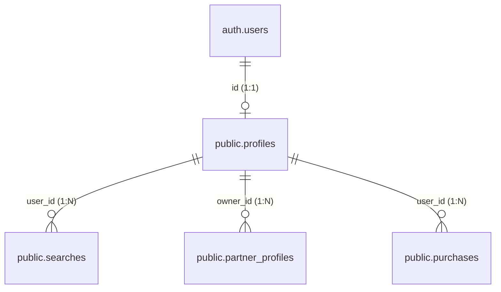
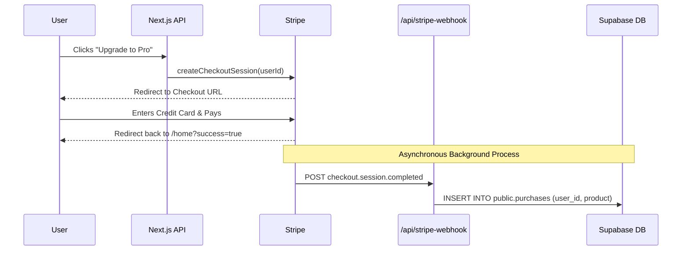

# Astronat Database & Architecture Overview

Based on your prompt documentation, here is a comprehensive breakdown of how your authentication, database schema, and Stripe billing fit together into a cohesive system.

## 1. Authentication (Login & Logoff)

Your authentication relies heavily on **Supabase Auth** working over cookies (via `@supabase/ssr`).

### The Login Flow
1. **Initiation**: A user clicks "Sign in with Google" inside your app.
2. **OAuth Provider**: Supabase redirects them to Google to authenticate.
3. **The Callback**: Google redirects them back to `http://localhost:3000/auth/callback` with a unique code.
4. **Session Creation**: Your route handler (`app/auth/callback/route.ts`) takes that code and asks Supabase for a User Session (JWT).
5. **Cookie Storage**: The `@supabase/ssr` library safely stores that JWT in an HTTP-only browser cookie. 
6. **The `auth.users` Table**: Under the hood, Supabase securely creates a row in a hidden system table called `auth.users` with their Google email and a unique `user.id`.

### The Logoff Flow
When you call `supabase.auth.signOut()` on the client:
1. Supabase destroys the active session on its servers.
2. The `@supabase/ssr` library immediately clears the browser cookies.
3. The next time the user tries to load a protected route (like `/home`), your `middleware.ts` runs, fails to find the cookie, and forces them back to `/auth/login`.

---

## 2. Database Schema & Profile Linkage

Your business logic database (the `public` schema) is built around a single, central concept: **Everything belongs to a Profile.**

### Profile Creation (The Missing Link)
Because Supabase handles `auth.users` automatically, you have to manually bridge the gap to your app data.

1. **New User Registration**: When a user logs in for the *very first time*, they have a row in `auth.users`, but **no row** in `public.profiles`.
2. **Onboarding**: Your callback route detects this missing profile and redirects them to finish Onboarding.
3. **Creation**: Once they finish onboarding, your app takes their birth data (City, Time, Date) and calls the `createProfile()` helper, inserting a new row into `public.profiles` using their newly minted `user.id` as the primary key.

### Row Level Security (RLS)
Every table is locked down perfectly using RLS. For example, `USING (auth.uid() = user_id)`. This guarantees that even if a malicious user tries to query the database directly from the browser, they can physically only ever retrieve their own searches, their own partners, and their own purchases.

---

## 3. The Stripe Connection

Payments work via a totally asynchronous, background process using **Stripe Webhooks**.

1. **Starting the Checkout**: When a user clicks "Upgrade", your backend generates a Stripe Checkout URL. Crucially, you pass the `user.id` into Stripe as `client_reference_id` or `metadata.userId`.
2. **The Webhook**: After a successful payment, Stripe sends a secret background HTTP request to your webhook endpoint. 
3. **Fulfillment**: Your webhook verifies Stripe's cryptographic signature, reads the `userId` attached to the payload, and inserts a row into `public.purchases`.
4. **App Reaction**: The next time the user loads `/profile`, your app sees the new row in `public.purchases` and grants them access to Pro features!
